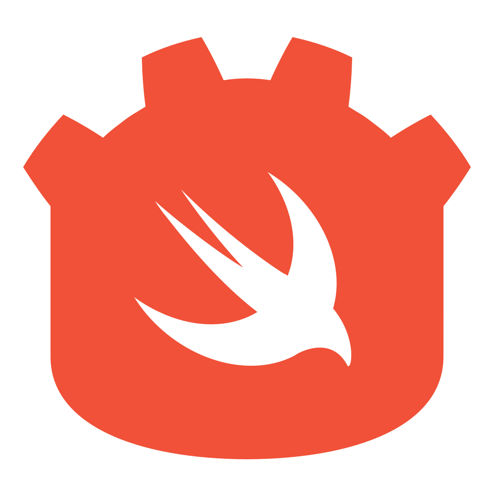

<p align="center">
    
    <br/>
    <strong><em>Swift for Godot</em></strong> <br/> <code>0.1.0</code>
</p>

*Godot Swift* is a [Swift Package Manager](https://swift.org/package-manager/) plugin that builds and packages Swift projects as [Godot Native](https://docs.godotengine.org/en/latest/tutorials/scripting/gdnative/what_is_gdnative.html) libraries.

```swift 
final class MySwiftClass: Godot.NativeScript {
    var foo: Int = 5
    
    init(delegate _: Godot.Unmanaged.Spatial) {}
    
    func bar(delegate _: Godot.Unmanaged.Spatial, x: Int) -> Int {
        self.foo * x
    }
    
    @Interface static var interface: Interface {
        Interface.properties {
            \.foo <- "foo"
        }
        
        Interface.methods {
            bar(delegate:x:) <- "bar"
        }
    }
}

extension Godot.Library {
    @Interface static var interface: Interface {
        MySwiftClass.self <- "MyExportedSwiftClass"
    }
}
```

### getting started 

*Godot Swift* uses the experimental Swift [package plugins](https://github.com/apple/swift-evolution/blob/main/proposals/0303-swiftpm-extensible-build-tools.md) feature, which is currently only available in recent [nightly Swift toolchains](https://swift.org/download/#snapshots). Because this feature is in active development, we *strongly recommend* using the following Swift toolchain version to avoid compilation issues:

* **`DEVELOPMENT-SNAPSHOT-2021-06-01-a`**

We recommend using [`swiftenv`](https://github.com/kylef/swiftenv) to manage multiple Swift toolchain installations. You can install a custom toolchain using `swiftenv` by passing the `swiftenv install` command the url of the toolchain on [swift.org](https://swift.org). 

For example, to install the `2021-06-01-a` snapshot on Ubuntu 20.04 x86_64, run: 

```bash 
swiftenv install \
https://swift.org/builds/development/ubuntu2004/swift-DEVELOPMENT-SNAPSHOT-2021-06-01-a/swift-DEVELOPMENT-SNAPSHOT-2021-06-01-a-ubuntu20.04.tar.gz
```

*Godot Swift* builds native libraries for [**Godot 3.3.0**](https://downloads.tuxfamily.org/godotengine/). 

> **Warning:** Although *Godot Swift* libraries should be compatible with later Godot versions, we *strongly recommend* using Godot 3.3.0 to avoid unrecognized-symbol errors at runtime.

To use *Godot Swift* in a project, add it as a dependency in `Package.swift`, and add the `GodotNative` module and the `GodotNativeScript` plugin to your build target.

```swift 
// swift-tools-version:5.5
import PackageDescription

let package = Package(
    name: "example",
    products: 
    [
        .library(name: "godot-swift-example", type: .dynamic, 
            targets: 
            [
                "GodotSwiftExample"
            ])
    ],
    dependencies: 
    [
        .package(url: "https://github.com/kelvin13/godot-swift/", .branch("master"))
    ],
    targets: 
    [
        .target(name: "GodotSwiftExample", 
            dependencies: 
            [
                .product(name: "GodotNative",      package: "godot-swift")
            ],
            plugins: 
            [
                .plugin(name: "GodotNativeScript", package: "godot-swift")
            ])
    ]
)
```

### [tutorials and example programs](examples/)

1. [basic usage](examples#basic-usage) ([`sources`](examples/swift/basic-usage.swift))
2. [advanced methods](examples#advanced-methods) ([`sources`](examples/swift/advanced-methods.swift))
3. [advanced properties](examples#advanced-properties) ([`sources`](examples/swift/advanced-properties.swift))
4. [signals](examples#signals) ([`sources`](examples/swift/signals.swift))
5. [life cycle management](examples#life-cycle-management) ([`sources`](examples/swift/life-cycle-management.swift))
6. [using custom types](examples#using-custom-types) ([`sources`](examples/swift/custom-types.swift))

### [api reference](https://kelvin13.github.io/godot-swift/)

* [`Godot`](https://kelvin13.github.io/godot-swift/Godot)
* [`Godot.Library`](https://kelvin13.github.io/godot-swift/Godot/Library)
* [`Godot.NativeScript`](https://kelvin13.github.io/godot-swift/Godot/NativeScript)

### [math library reference](https://kelvin13.github.io/godot-swift/)

* [`Vector<Storage, T>`](https://kelvin13.github.io/godot-swift/Vector)
* [`Vector<Storage, T>.Plane`](https://kelvin13.github.io/godot-swift/Vector/Plane)
* [`Vector<Storage, T>.Rectangle`](https://kelvin13.github.io/godot-swift/Vector/Rectangle)
* [`Vector<Storage, T>.ClosedRectangle`](https://kelvin13.github.io/godot-swift/Vector/ClosedRectangle)
* [`Quaternion<T>`](https://kelvin13.github.io/godot-swift/Quaternion)
